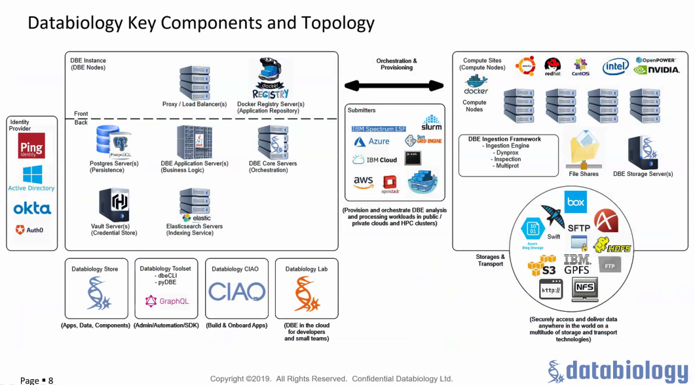
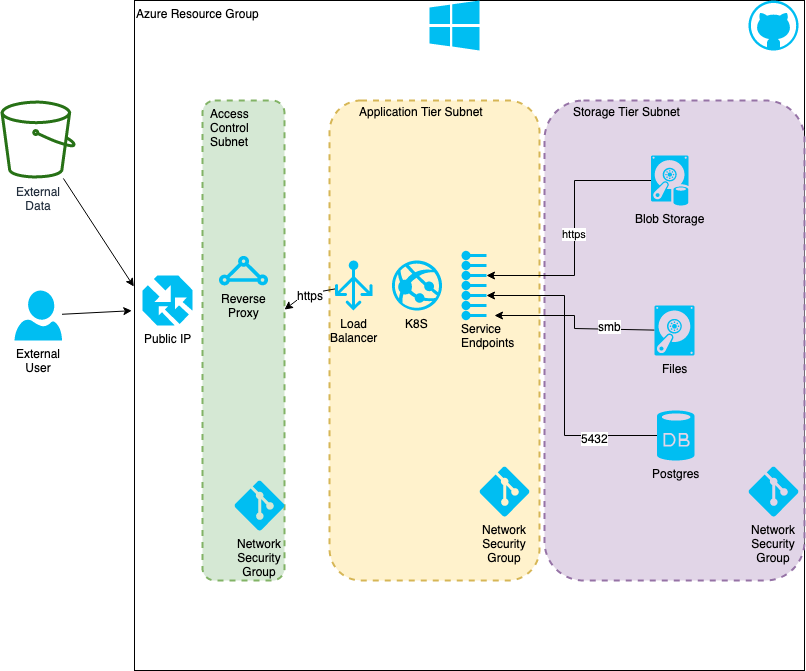

## Section 1: Product Summary

| Product Name | Ask ID          | Technical Lead | PMO Lead       |Target Platform | Template Version |
| ------------ | --------------- | -------------- | -------------- | -------------- | ---------------- |
| ClinicoGenomics Platform and Analytics  | UHGWM110-026707 | Randy Olinger      | Carlos Garcia      | Azure | 4.0.0           |

### Description
ClinicoGenomics is a set of applications and capabilites that allow our business partners in Optum Insight to manage and share data with approved partners both internal and external to the company.  There are services for ingetion of data, translation to data models, indexing, search, and analysis.  The data sets are deidentified and contain both genomic and clinical data

Housing this application in public cloud gives it flexibility and speed, as well as elasticity to varying demand loads.  Different aspects of the application can be partitioned to private networks with only explicit listing of available network transmission paths.

### Data Details

The data for ClinicoGenomics comes from various sources in UHG and is managed by the Insight business.  Only deidentified data sets are to be shared with outside entities for purposes of research or commercialization.

#### Upstream Sources

Genomic data will be transferred into the environment from external suppliers such as Color Genomics and The Broad Institute, as they provide wet lab services and primary sequencing.

#### Data access
Applications are all browser based and data will remain in the environment to be accessed and operated on using standard tools such as Python, R, or other programming languages as needed.

#### Downstream Targets
Raw data will remain in the environment while created data (summaries, analytics, visualizations, etc) may be extricated to local copies.  As there is no PHI in the environment (deidentified only) there is no risk of data loss.

#### Data Capacity
Depending on the types of data that are brought in for various customers or projects we could see from a few TB to several PB of data housed in the environment.  Azure storage blobs are the primary place to store bulk data files of type fastq, bam, cram, or vcf.  Postgres databases will house metadata, as well as elastic search.

### User Details
Users will be both internal to UHG/Optum and external depending on sales opportunities identified.  An Oauth Identity provider will be used such as OneLogin and/or OptumID.  Users will be managed in groups.

### External API documentation
Gen3 and Databiology have exhaustive API documentation available on their sites.

- [Gen3 Developer Docs](https://gen3.org/resources/developer/microservice/)

### Workload Placement use case

> **Guidance**: Please describe how your use case meets one (or more) of the below criteria.  Addressing more than one use case is advantageous.   Additional placement guidance can be found 

> - **Commercial Initiative:** As described above, this solution will support external commercial customers.
> - **Volatile or Elastic Capacity:** We expect resource usage to wax and wane considerably due to the project oriented nature of the sales cycle.  As this is a new business opportunity in an emerging segment, elastic capacity in both directions (grow and shrink) is critical to managing costs.

## Section 2: Code Delivery and Management

### Infrastructure as Code

We will be managing resources using terraform scripts already under development.  For builds we will use Jenkins automation and the Optum PipelineAsCode routines so as to fit into our general patterns.  Source code is stored in Github Enterprise.

### Code Promotion
Code promotion will be managed with a "Blue/Green" technique where we will build a new deployment and gradually migrate users over to ensure quality of release.   This is for major releases only, as we will support minor releases using CICD.

## Section 3: Architecture Summary

### Architecture Overview

## Section 4: Network Summary

## Section 5: Security Criteria

### Security Considerations

There are no exceptions to standard security models at this time.  Inbound and outbound data will be over TLS/SSL.  Administrator acceess will be managed via global groups in the ENTID domain.  File ingestion will be PULLING files into the environment, mostly from S3 or by using the enterprise ECG system.

### EIS Security Intent Review

14 Principle Areas

- Cloud Agreements
    - this is part of the existing CSP contracts with Azure and AWS
- Encryption
  - All traffic inbound and oubound will use SSL/TLS.  All data at rest is encrypted per Azure policies.
- Boundary Protection
  - Network security groups will be used to ensure not only protection at the external boundary, but also protection between subnets and environments.
- Cloud Access
  - External data sources may be pulled in from other clouds managed by partners or customers.  OAuth IDP's are used for application identity management.  OneLogin and Optum ID are the two primary IDP's being supported.
- Threat & Vulnerability Management
  - Fortify and Barista scanning shall be utilized to ensure known coding vulnerabilities do not make their way into the environment, and are remediated quickly if found.
  - Azure logging is in place and existing teams will be utilized to manage security events.
  - Virtual machines will be managed with a configuration management system such as Chef in order to facilitate patching and environment compliance.
- Baseline Configuration Compliance
  - Baseline images with minimal attack surfaces shall be selected for virtual machines.
  - Configuration Management driven by Chef or the like will ensure against drift.
- Perimeter Defense
  - Data storage modules (blobs, databases, file stores) will be isolated to a bespoke network segment with access restricted only to modules serving the application.
- Logging & Monitoring
  - Custom code will log events to shared Azure event monitoring infrastructure, or if none exists a syslog server will be set up to capture and integrate logs.
  - docker containers will generate logs and be aggregated in blob storage.
  - Azure native log management will be used whenever possible.
- Cyber-defense Operations (CDO) Integration
  - Logs will be made available to the CDO team and if deemed necessary shipped back to on premise systems periodically.
- Authentication & Authorization
  - Authentication for the application layers is provided by OAUTH IDP's such as OptumID and OneLogin, both of which are existing Insight managed providers.  These each provide 2FA, strong passwords, and centralized user and group management.
  - Gen3 and Databiology also have their own ability to define further role based access control which shall be provisioned to users on an as-needed basis.
- Data Protection
  - DP as a service before data is brought into the environment
  - Md5 checksums will be kept on all files at ingestion and stored as part of the metadata to ensure tampering has not occurred.  Genomic source data is imutable.
  - Backups of critical data either by replication to alternate region or in cases of file backup, to Blob storage.
- App Protection
  - Native controls in Gen3 and Databiology applications shall be utilized for administrative control.
  - Operating system logins shall be restricted to only administrative levels and not granted to end users.
  - If any Windows servers or VDI are created, Malware detection and quarantine software will be installed to enssure against malware entering into the environment.
- Secure Coding
  - Secure coding techniques are in use and shall be audited by tools such as Fortify and Barists.
  - Known critical and high vulnerabilities will be remeidated at earliest opportunity.
  - Commercial software from DataBiology will be kept at versions that ensure security with best practices from the vendor.
